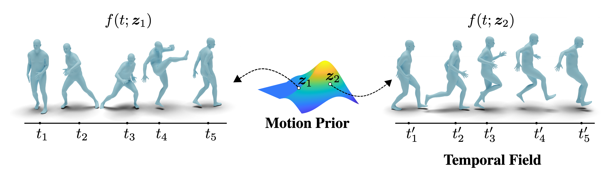

# NeMF: Neural Motion Fields for Kinematic Animation (NeurIPS 2022)

### [Paper](https://arxiv.org/abs/2206.03287) | [Project](https://cs.yale.edu/homes/che/projects/nemf/)

[Chengan He](https://cs.yale.edu/homes/che/)<sup>1</sup>, [Jun Saito](https://research.adobe.com/person/jun-saito/)<sup>2</sup>, [James Zachary](https://jameszachary.com/)<sup>2</sup>, [Holly Rushmeier](https://graphics.cs.yale.edu/people/holly-rushmeier)<sup>1</sup>, [Yi Zhou](https://zhouyisjtu.github.io/)<sup>2</sup>

<sup>1</sup>Yale University, <sup>2</sup>Adobe Research



## Prerequisites

This code was developed on Ubuntu 20.04 with Python 3.9, CUDA 11.3 and PyTorch 1.9.0. 

### Environment Setup

To begin with, please set up the virtual environment with Anaconda:
```bash
conda create -n nemf python=3.9
conda activate nemf
pip install -r requirements.txt
```

### Body Model

Our code relies on [SMPL](https://smpl.is.tue.mpg.de/) as the body model. You can download our processed version from [here](https://yaleedu-my.sharepoint.com/:u:/g/personal/chengan_he_yale_edu/EdwVlZxMHJtGs4aM2Yp7mv4B1V9w4BanJv9N1Z9-y376jg?e=M3Yiv6).

### Datasets

#### AMASS

[AMASS](https://amass.is.tue.mpg.de/) mocap data is used to train and evaluate our model in most of the experiments. After downloading its raw data, we run the [processing scripts](https://github.com/davrempe/humor/tree/main/data#amass) provided by HuMoR to unify frame rates, detect contacts, and remove problematic sequences. We then split the data into training, validation and testing sets by running:
```bash
python src/datasets/amass.py amass.yaml
```
You can also download our processed AMASS dataset from [here](https://yaleedu-my.sharepoint.com/:u:/g/personal/chengan_he_yale_edu/EQnq2uAfhSZNgxMK1YNXj8sB5Y_0KWq1xPAcWGw3NpM6_w?e=nTOWgw).

#### MANN

The dog mocap data in [MANN](https://github.com/sebastianstarke/AI4Animation/tree/master/AI4Animation/SIGGRAPH_2018) is used to evaluate the reconstruction capability of our model in long sequences, whose raw data can be downloaded from [here](http://www.starke-consult.de/AI4Animation/SIGGRAPH_2018/MotionCapture.zip). To process the data, we first manually remove some sequences on uneven terrain and then run:
```bash
python src/datasets/animal.py dog_mocap.yaml
```
Our processed data can be downloaded from [here](https://yaleedu-my.sharepoint.com/:u:/g/personal/chengan_he_yale_edu/ESlxRrLA4GdBsKTv2SegEFsBX-4WueGIUa9yNMnHDwtFjg?e=R6GOqU).

> **Note:** All the preprocessed data mentioned before should be extracted to the `data` directory. Otherwise you need to update the configuration files to point them to the path you extracted.

## Quickstart

We provide a pre-trained [generative NeMF model](https://yaleedu-my.sharepoint.com/:u:/g/personal/chengan_he_yale_edu/ERadqRp5XedAn0pOyGeFWOMB3LH7g7w9c4OyzB7nmweHqA?e=8P1NWU) and [global motion predictor](https://yaleedu-my.sharepoint.com/:u:/g/personal/chengan_he_yale_edu/ERmQUqW5z_tAncGS1XzTJ6sBGnIxEawVgK9J-vID-uT6iw?e=TC6wfQ). Download and extract them to the `outputs` directory.

### Application

We deploy our trained model as a generic motion prior to sovle different motion tasks. To run the applications we showed in the paper, use:
```bash
python src/application.py --config application.yaml --task {application task} --save_path {save path}
```
Here we implement several applications including `motion_reconstruction`, `latent_interpolation`, `motion_inbetweening`, `motion_renavigating`, `aist_inbetweening`, and `time_translation`. For `aist_inbetweening`, you need to download the motion data and dance videos from [AIST++ Dataset](https://google.github.io/aistplusplus_dataset/download.html) and place them under `data/aist`. You also need to have [FFmpeg](https://ffmpeg.org/) installed to process these videos.

### Evaluation

To evaluate our trained model on different tasks, use:
```bash
python src/evaluation.py --config evaluation.yaml --task {evaluation task} --load_path {load path}
```
The tasks we implement here include `ablation_study`, `comparison`, `inbetween_benchmark`, `super_sampling`, and `smoothness_test`, which cover the tables and figures we showed in the paper. The quantitative results will be saved in `.csv` files.

To evaludate FID and Diversity, we provide a pre-trained feature extractor at [here](https://yaleedu-my.sharepoint.com/:u:/g/personal/chengan_he_yale_edu/EVXKF8Tc1t5CnrkswLS0qUoBi_1YsDa_BpMDAalEuTblSQ?e=bcxHAP), which is essentially an auto-encoder. You can train a new one on your data by running:
```
python src/train.py evaluation.yaml
```

## Train NeMF from Scratch

In our paper we proposed three different models: a single-motion NeMF that overfits specific motion sequences, a generative NeMF that learns a motion prior, and a global motion predictor that generates root translations separately. Below we describe how to train these three models from scratch.

### Training Single-motion NeMF

To train the single-motion NeMF on AMASS sequences, use:
```
python src/train_basic.py basic.yaml
```
The code will obtain sequences of 32, 64, 128, 256, and 512 frames and reconstruct them at 30, 60, 120, and 240 fps.

To train the model on dog mocap sequences, use:
```
python src/train_basic.py basic_dog.yaml
```

### Training Generative NeMF

To train the generative NeMF on AMASS dataset, use:
```
python src/train.py generative.yaml
```

### Training Global Motion Predictor

To train the global motion predictor on AMASS dataset, use:
```
python src/train_gmp.py gmp.yaml
```

## Visualization and Rendering

Our codebase outputs `.npz` data following the AMASS data format, thus they can be visualized directly with the [SMPL-X Blender add-on](https://smpl-x.is.tue.mpg.de/). To render the skeleton animation of `.bvh` files, we use the rendering scripts provided in [deep-motion-editing](https://github.com/DeepMotionEditing/deep-motion-editing).

## Acknowledgements

- Our bvh I/O code is adapted from the [work](https://theorangeduck.com/media/uploads/other_stuff/motionsynth_code.zip) of [Daniel Holden](https://theorangeduck.com/page/publications).
- The code in `src/rotations.py` is adapted from [PyTorch3D](https://github.com/facebookresearch/pytorch3d/blob/main/pytorch3d/transforms/rotation_conversions.py).
- The code in `src/datasets/amass.py` is adapted from [AMASS](https://github.com/nghorbani/amass/blob/master/src/amass/data/prepare_data.py).
- The code in `src/nemf/skeleton.py` is taken from [deep-motion-editing](https://github.com/DeepMotionEditing/deep-motion-editing) and our code structure is also based on it.
- Part of the code in `sec/evaluation.py` is adapted from [Action2Motion](https://github.com/EricGuo5513/action-to-motion/tree/master/eval_scripts).
- Part of the code in `src/utils.py` is taken from [HuMoR](https://github.com/davrempe/humor/blob/b86c2d9faf7abd497749621821a5d46211304d62/humor/scripts/process_amass_data.py).
- The code in `src/soft_dtw_cuda.py` is taken from [pytorch-softdtw-cuda](https://github.com/Maghoumi/pytorch-softdtw-cuda).

**Huge thanks to these great open-source projects!**

## Citation

If you found this code or paper useful, please consider citing:
```
@inproceedings{he2022nemf,
    author = {He, Chengan and Saito, Jun and Zachary, James and Rushmeier, Holly and Zhou, Yi},
    title = {NeMF: Neural Motion Fields for Kinematic Animation},
    booktitle = {NeurIPS},
    year = {2022}
}
```

## Contact
If you run into any problems or have questions, please create an issue or contact `chengan.he@yale.edu`.
